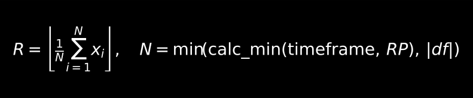
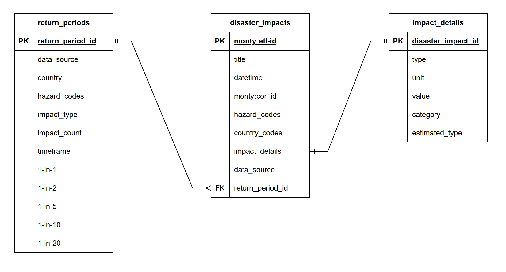

# RP_calculation
Calculating impact of disasters based on return periods

# Table of Contents
- [Overview](#overview)
- [Architecture](#architecture)
- [Return Period Calculation Methodology](#return-period-calculation-methodology)
- [Data Structure](#data-structure)

## Overview
This pipeline ingests disaster impact data from the Montandon API, the world’s largest disaster database. 
It then estimates the quantified impact across different impact types, using factors such as the event’s return period, disaster type, and country of origin.

## Architecture
### Data Collector
1. Call 'collections' endpoint to collect all the data sources available on the Montandon API. (**datacollector.py**)
2. Identify all the 'impact' collection tables and access them individually to download the disaster impact data.
3. Clean the links given. (account for potentially invalid links provided by the endpoint) 
3. When downloading, limit the batch to maximum 200 entries per call to avoid exceeding the server RAM capacity.
4. To avoid slowing down of device, the rows per file is capped at 3000.

### Return Period Calculation
1. Group CSV files based on source. Source is identifiable through the filename. (naming convention: **{SOURCE}_{INDEX}.csv**)
2. Clean the date field and remove all fields except 'country', 'date', 'disaster_type', 'impact_type', 'impact_quantity', 'data_source'
3. Group the impacts by country, disaster, and type of impact.
4. Merge some rows by mapping synonymous impact_type categorizations.
5. Calculate the impact_quantity of impact_type for particular disaster type in certain country for respective return period.
6. Merge all transformation into one singular table.

## Return Period Calculation Methodology

    

**Where:**
- `RP` = Return Period *(1 year, 2 years, 5 years, 10 years, or 20 years)*
- `calc_min` = a function that returns the minimum value derived from the quotient of the passed variables
- `df` = your dataset
- `x_i` = the *impact_quantity* value of the *i-th* rank where the *impact_quantity* is sorted based on severity.
- `N` = number of rows considered (limited by `calc_min` or dataset length)

## Data Structure

  

This project organizes disaster impact data, detailed event information, and derived return period estimates. The schema is designed to capture individual disaster events, enrich them with detailed impact data, and then summarize these records into probabilistic return period estimates.

---

### Tables

#### `disaster_impacts`
Stores individual disaster events and their metadata.

**Key fields:**
- `monty:etl-id` (Primary Key)
- `title`, `datetime`
- `hazard_codes`, `country_codes`
- `monty:cor_id`, `data_source`
- `return_period_id` (Foreign Key → `return_periods`)

**Notes:**
- Each row represents one disaster event.
- Linked to detailed impacts in `impact_details`.

---

#### `impact_details`
Captures specific impact metrics for each disaster.

**Key fields:**
- `disaster_impact_id` (Primary Key, FK → `disaster_impacts`)
- `type` (e.g., fatalities, economic loss, affected people)
- `unit`, `value`, `category`, `estimated_type`

**Notes:**
- One-to-many relationship with `disaster_impacts`.
- Provides granular measurements for each event.

---

#### `return_periods`
Derived summary table with long-term probabilistic estimates.

**Key fields:**
- `return_period_id` (Primary Key)
- `data_source`, `country`, `hazard_codes`
- `impact_type`, `impact_count`, `timeframe`
- Estimated impacts for:
  - `1-in-1`, `1-in-2`, `1-in-5`, `1-in-10`, `1-in-20`

**Notes:**
- Groups `disaster_impacts` by:
  - **country**
  - **hazard type**
  - **impact type**
- Contains calculated return period estimates.

---

### Data Flow

1. **Raw Events** → Stored in `disaster_impacts`.
2. **Detailed Impacts** → Linked via `impact_details`.
3. **Aggregation & Estimation** → Group events by country, hazard type, and impact type.
4. **Return Period Estimates** → Store results in `return_periods`, providing expected impacts for different recurrence intervals.

---

### Example Usage

- Query individual disaster events and their impact details.
- Generate return period summaries for disaster risk analysis.
- Use `return_periods` to estimate expected impacts for **1-in-1, 1-in-2, 1-in-5, 1-in-10, and 1-in-20 year disasters**.